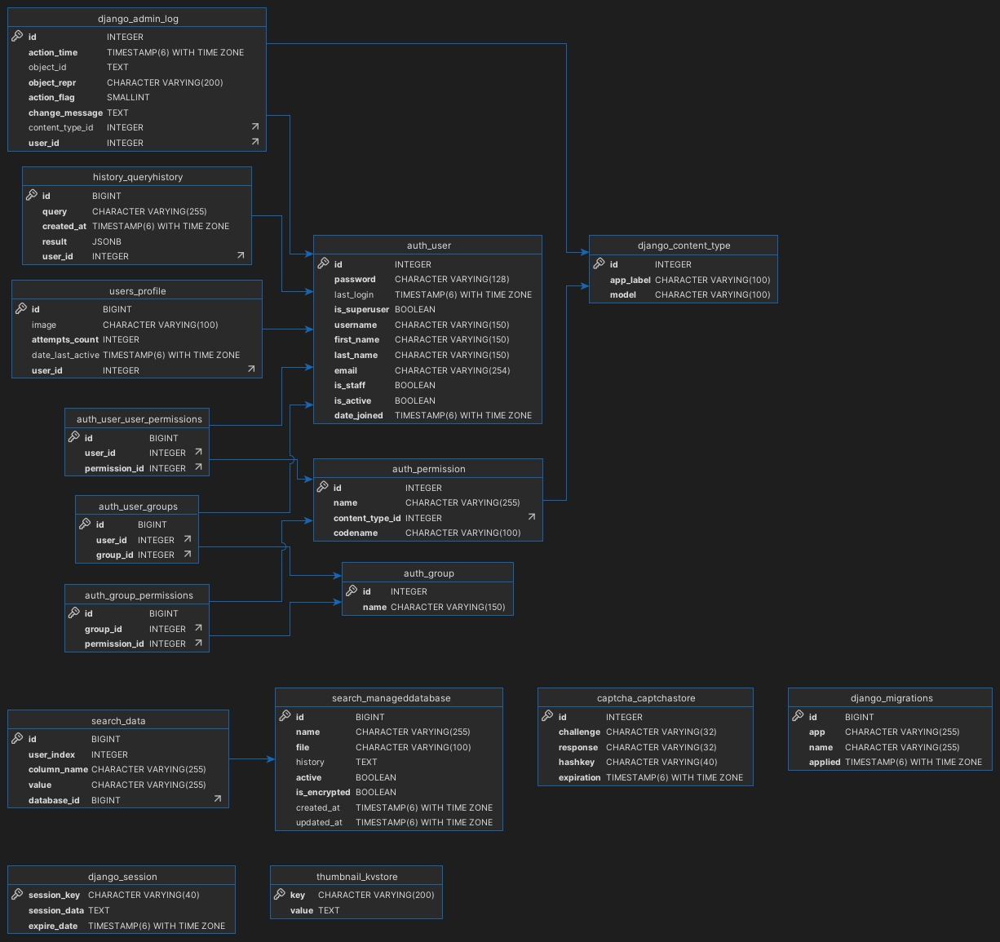

# Lambda Search

Проект доступен по адресу <https://lambda-search.ru>

## О проекте

Lambda Search — это инструмент, созданный для проверки, были ли ваши данные скомпрометированы в результате утечек. Мы ориентированы на российских пользователей и учитываем локальные риски и угрозы. Сервис предоставляет удобный интерфейс для анализа утечек, позволяя пользователям быстро реагировать на возможные угрозы.

## Требования

- Python 3.12.1
- PostgreSQL (установка: [PostgreSQL Official Docs](https://www.postgresql.org/download/))
- Redis
- Celery

## Запуск проекта доступен двух видов

1. Нативно по [инструкции](#инструкция-по-нативному-запуску-проекта)
2. Через Docker контейнер по [инструкции](#запуск-через-docker-в-prod-режиме)

## Инструкция по нативному запуску проекта

1. **Клонируйте репозиторий:**

    ```bash
    git clone https://https://github.com/mavinsplay/lambda-search.git
    cd lambda_search
    ```

2. **Создайте и активируйте виртуальное окружение:**

    На Linux/macOS:

    ```bash
    python3 -m venv venv
    source venv/bin/activate
    ```

    На Windows:

    ```bash
    python3 -m venv venv
    venv\Scripts\activate
    ```

    **Обновите pip:**

    ```bash
    python3 -m pip3 install --upgrade pip
    ```

3. **Установите зависимости:**

    Основные:

    ```bash
    pip3 install -r requirements/prod.txt
    ```

    Для тестирования:

    ```bash
    pip3 install -r requirements/test.txt
    ```

    Для разработки:

    ```bash
    pip3 install -r requirements/dev.txt
    ```

4. **Настройка окружения:**

    ```bash
    cp .env.template .env
    ```

5. **Настройка Redis и Celery:**

    **Windows:**

    Установка Redis через Docker:

    ```bash
    docker pull redis
    docker run -d -p 6379:6379 --name redis redis
    ```

    Создайте файл `run_celery.bat` в корне проекта:

    ```batch
    @echo off
    cd /d D:\lambda-project\lambda-search
    call .venv\Scripts\activate.bat
    cd lambda_search
    celery -A lambda_search worker --pool=solo -l DEBUG
    pause
    ```

    **Linux:**

    Установка Redis:

    ```bash
    sudo apt update
    sudo apt install redis-server
    sudo systemctl start redis-server
    ```

    Запуск Celery:

    ```bash
    celery -A lambda_search worker -l INFO
    ```

    **macOS:**

    Установка Redis:

    ```bash
    brew install redis
    brew services start redis
    ```

    Запуск Celery:

    ```bash
    celery -A lambda_search worker -l INFO
    ```

6. **Выполните локализации:**

    Установка gettext:

    - Windows: [gettext](https://mlocati.github.io/articles/gettext-iconv-windows.html)
    - Linux: `sudo apt-get install gettext`
    - macOS: `brew install gettext`

    Компиляция локализаций:

    ```bash
    cd lambda_search
    django-admin compilemessages
    ```

7. **Примените миграции:**

    ```bash
    python3 manage.py makemigrations
    python3 manage.py migrate
    ```

8. **Запустите сервер:**

    ```bash
    python3 manage.py runserver
    ```

    Сервер будет доступен по адресу [http://127.0.0.1:8000/](http://127.0.0.1:8000/)

## Другие команды

**Создание суперпользователя:**

```bash
python3 manage.py createsuperuser
```

**Запуск тестов:**

```bash
python3 manage.py test
```

## Запуск через Docker в prod-режиме

1. Скачайте и установите [Docker](https://www.docker.com/)
2. Настройте окружение
3. Запустите контейнер:

    ```bash
    docker compose down
    docker compose --profile prod up --build -d
    ```

## ER-диаграмма БД

